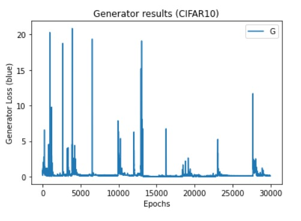
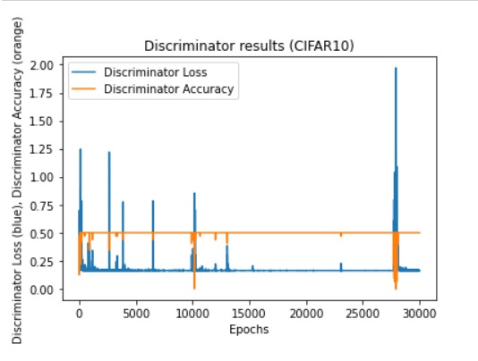
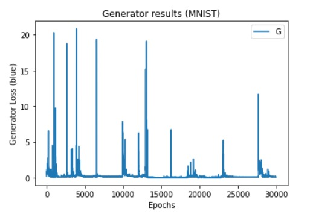
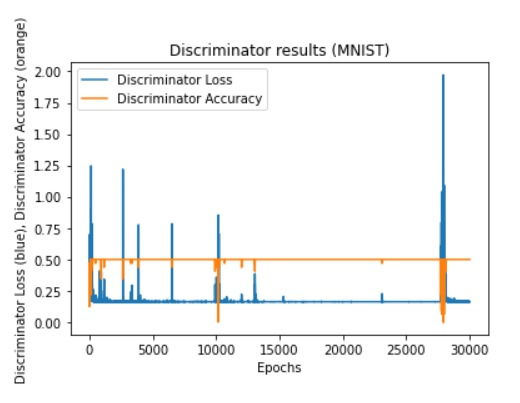

# CapsuleGAN Implementation
GANs (generative adversarial networks) have recently received a lot of attention.
However, using GANs to generate images is tough. As a result, GANs occasionally produce images of poor quality. Convolutional neural networks are used in these GANs (CNNs). CNNs, on the other hand, have the flaw of losing relational information between image features. Hinton proposed the Capsule Network in 2017, which solves CNN's flaw. Capsule Network is used in the discriminator by Capsule GAN, as previously reported. Capsule GAN, on the other hand, instead of using Capsule Network, uses CNNs in generator architectures like DCGAN, as reported in prior studies. In this project, two techniques to using Capsule Network in the generator are presented. One option is to utilise the discriminator's DigitCaps layer as the generator's input. The DigitCaps layer is the Capsule Network's output layer. It has the characteristics of the discriminator's input images. The alternative option is to employ the Capsule Network's reverse recognition procedure in the generator. We compare the Capsule GAN described in this paper to traditional GANs that employ CNN and Capsule GANs that simply use the Capsule Network as a discriminator. MNIST, Fashion-MNIST, and colour images are the datasets.
## Output of our Model on the mentioned datasets
 &ensp;  
 &ensp;  
 &ensp; 
 &ensp;
